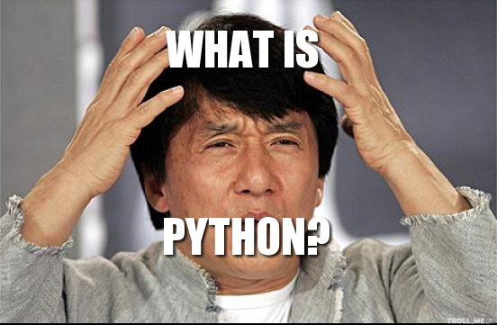
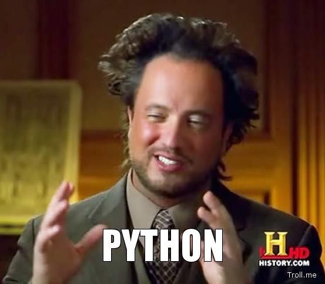
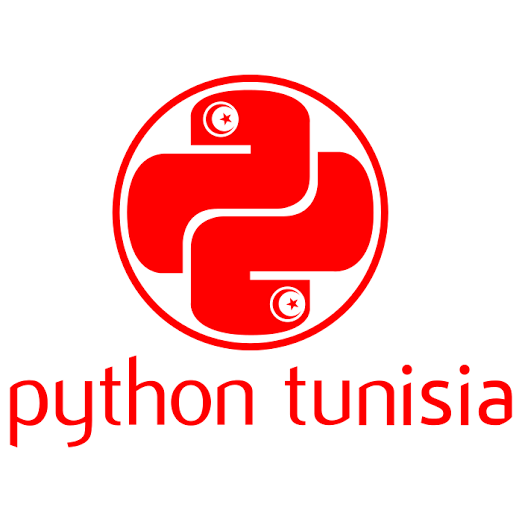

:title: Slideshow Tutorial
:author: Lennart Regebro
:description: The Hovercraft! tutorial.
:keywords: presentation, restructuredtext, impress.js, tutorial
:css: tutorial.css

This slide show is a sort of tutorial of how to use Hovercraft! to make
presentations. It will show the most important features of Hovercraft! with
explanations. 

Hopefully you ended up here by the link from the official documentation at
https://hovercraft.readthedocs.org/ . If not, you probably want to go there
and read through it first.

This totorial is meant to be read as source code, not in any HTML form, so if
you can see this text (it won't be visible in the final presentation) and you
aren't seeing the source code, you are doing it wrong. It's going to be
confusing and not very useful. Again, go to the official docs. There are
links to the source code in the Examples section.

You can render this presentation to HTML with the command::

    hovercraft positions.rst outdir
    
And then view the outdir/index.html file to see how it turned out.

**Now then, on to the tutorial part!**

The first thing to note is the special syntax for information about the
presentation that you see above. This is in reStrcuturedText called "fields"
and it's used all the time in Hovercraft! to change attributes and set data
on the presentation, on slides and on images. The order of the fields is not
important, but you can only have one of each field.

The fields above are meta-data about the presentation, except for the
:css:-field. This meta data is only useful if you plan to publish the
presentation by putting the HTML online. If you are only going to show this
presentation yourself in a meeting you can skip all of it.

The title set is the title that is going to be shown in the title bar of the
browser. reStructuredText also have a separete syntax for titles that is also
supported by Hovercraft::

    .. title:: Slideshow Tutorial

However that requires an empty line after it, and it looks better to use the
same syntax for all metadata.

The :css: field will add a custom CSS-file to this presentation. This is
something you almost always want to do, as you otherwise have no control over
how the presentation will look. You can also specify different media for
the CSS, for example "screen,projection"::

    :css-screen,projection: hovercraft.css
    
This way you can have different CSS for print and for display. You can only
specify one CSS-file per field, however. If you want to include more you
need to use the @import directive in CSS.

Once you have added metadata and CSS, it's time to start on the slides.

You separate slides with a line that consists of four or more dashes. The
first slide will start at the first such line, or at the first heading. Since
none of the text so far has been a heading, it means that the first slide has
not yet started. As a result, all this text will be ignored in the output.

So lets start the first slide by having a line with four dashes. Since the
first slide starts with a heading, that line is strictly speaking not needed,
but it's good to be explicit.

#Guido
#https://d262ilb51hltx0.cloudfront.net/max/1200/1*YTOR_HRyCoIR-yKB3Sdxaw.jpeg

----

# whoami
========

.. code:: python
    
    # I am a
    print(
        "Pythonista since 2009",
        "Founded Python Tunisia Community"
        "Open Source fanatic",
        "Developing a cloud infrasturcture managment solution",
        "Blessed to code python on my day job"
    )
    
    # yeah I have 6000+ unread emails, one day I will trash them all.
    email = "ghassen.telmoudi@gmail.com"
    # I love that place.
    github = "https://github.com/pyghassen"

----

Python, do you know it?
=======================

.. code:: python

    print("Classic Jacky what!")

----

.. image:: images/python-logo-master-v3-TM.png

.. code:: python

    python_info = [
        "High level",
        "General purpose",
        "Open Source",
        "Multi-paradigm (Oject Oriented and Functional)",
        "Interpreted and Interactive",
        "Cross-platform",
    ]

.. _Python: http://www.python.org

----

.. code:: python
    
    python = {
        "who": "Python founder",
        "name": "Guido Van Rossum",
        "when": "1991",
        "where": "The Netherlands",
    }

----

Hello Python Tunisia in C
=========================

.. code:: c
    
    #include<stdio.h>

    int main() 
    {
        printf("Hello Python Tunisia!\n");
        return 0;
    }; 

    // 63 characters and 6 lines! }

----

Hello Python Tunisia in Java
============================

.. code:: java
    
    import java.io.*;
    public class Helloworld
    {
      public static void main(String[] args)
        { 
          System.out.println("Hello Python Tunisia!");
        }
    }

    // comes in at a 115 characters and a verbose 8 lines!

----
 
Hello Python Tunisia in Python
==============================

.. code:: python
    
    print("Hello World")

    # Comes in as little as 20 characters and only 1 line

----

.. code:: python

    print("The ancient aliens guy said it!")

----

Python philosophy
=================

.. code:: python

    >>> import this

    The Zen of Python, by Tim Peters

    Beautiful is better than ugly.
    Explicit is better than implicit.
    Simple is better than complex.
    Complex is better than complicated.
    Flat is better than nested.
    Sparse is better than dense.
    Readability counts...

----

Python Data types
=================

.. code:: python
    
    _list = ["Python", "Tunisia", "on", "SFD"]
    tuple = (1, 2, 3)

    _set = {"this", "a", "set"}
    dictionary = {
        "date", "2014-10-19",
        "location": "Monastir, Tunisia"
    }
    string = "yeah you guessed it, this a string"
    _int = 23
    _float = 9.99

----

Python functions
=================

.. code:: python

    def hello(name):
        """
        Says Hello.

        @name: string
        
        """
        message = "hello {}".formt(name)
        print(message)

----

Python functions
=================

.. code:: python

    def say_many_hellos(name, times=3):
        """
        Says Hello N times.

        @name: string
        @times: int

        """
        messages = ["hello {}\n".formt(name) for name in range(len(times)]
        # Joins the list of messages and returns them as one String.
        return "".join(messages)

----

Python Class
=================

.. code:: python

    class Developper(object):
        """
        Defines a developer object.
        """
        def __init__(self, name):
            """
            @name: string
            """
            self.name = name

        def say_hello(self):
            """
            Ruturs a friendly message.

            """

            return "Hello my name is {}".format(self.name)

    if __name__ == '__main__':
        developer = Developper("Ghassen Telmoudi")
        developer.say_hello()

----

Python Tunisia
==============

----

Python and education in Tunisia
================================
.. code:: python

    print("You should learn it in school.")

----

That's all folks!
=================

.. code:: python

    print("I know you're hungry, but it' time to some Qs")

----

y.
